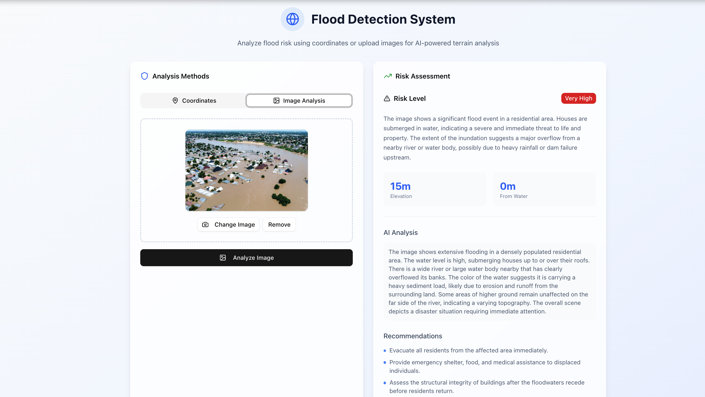

# TideWatch ai-flood-analysis repo

## Motivation

Floods are among the most devastating natural disasters, impacting millions of lives every year. My motivation for building this project is deeply personal: I have family members and close friends who live in flood-prone areas in both India and the U.S., and I have witnessed the anxiety and disruption that floods can cause. This project is my way of using my knowledge of Large Language Models (LLMs) and Machine Learning to help spread awareness, provide actionable insights, and empower communities to better understand and prepare for flood risks. By combining advanced AI with accessible web technology, I hope to make a positive impact and contribute to disaster resilience and education.


## Project Overview

**ai-flood-analysis** is a full-stack monorepo for flood risk assessment, prediction, and visualization. It combines a Python FastAPI backend (powered by Google's Gemini AI) and a modern Next.js frontend for an interactive, AI-driven user experience.

---

## Demo

Below is a screenshot of the Flood Detection System in action, showing image-based flood risk analysis and AI-powered recommendations:



---

---

## Features

- **AI-Powered Flood Prediction:** Analyze historical and real-time data for accurate flood risk assessment using Gemini AI.
- **Coordinate Analysis:** Enter latitude/longitude for location-based risk assessment.
- **Image Analysis:** Upload terrain photos for AI-powered visual analysis.
- **Interactive Map:** Visualize locations with risk overlays.
- **RESTful API:** Endpoints for predictions, data queries, and model insights.
- **Clean UI:** Modern, responsive design with shadcn/ui components.
- **Modular Monorepo:** Clear separation of backend and frontend for easy development and deployment.

---

## Repository Structure

- `backend/` — Python FastAPI backend for AI modeling, data processing, and API endpoints.
- `flood-analyser-frontend/` — Next.js frontend for visualization, user input, and dashboard features.

---

## Example Use Cases

- **City Planners:** Assess flood-prone areas and plan infrastructure accordingly.
- **Emergency Responders:** Visualize real-time flood risk to optimize response strategies.
- **Researchers:** Analyze historical flood data and model performance.
- **General Public:** Access easy-to-understand flood risk maps and safety tips.

---

## Quick Start

### 1. Get Gemini API Key

1. Go to [Google AI Studio](https://aistudio.google.com/app/apikey)
2. Create a new API key
3. Copy the API key

### 2. Start Both Servers Together (Recommended)

```bash
# Set up Gemini API key
cd backend
echo "GEMINI_API_KEY=your_gemini_api_key_here" > .env

# Start both servers
./start-dev.sh
```

Access the app at:
- **Frontend**: http://localhost:3000
- **Backend API**: http://localhost:8000
- **API Docs**: http://localhost:8000/docs

### 3. Start Servers Separately (Optional)

#### Backend Setup
```bash
cd backend
python3 -m pip install -r requirements.txt
echo "GEMINI_API_KEY=your_gemini_api_key_here" > .env
python3 start.py
```

#### Frontend Setup
```bash
cd flood-analyser-frontend
npm install
npm run dev
```

---

## How to Use

1. **Coordinate Analysis:** Enter latitude and longitude coordinates for flood risk assessment.
2. **Image Analysis:** Upload terrain photos for AI-powered visual analysis.
3. **Interactive Map:** Explore risk overlays and dashboard features.

---

## Backend Details

### Features

- **Gemini AI Integration:** Uses Google's Gemini 2.5 Flash for intelligent analysis
- **Coordinate & Image Analysis:** Analyze flood risk based on coordinates and/or images
- **Combined Analysis:** Merge coordinate and image data for comprehensive assessment
- **Simple & Fast:** No complex computer vision libraries, just pure AI analysis

### Running the Backend

```bash
# Create virtual environment (recommended)
python -m venv venv
source venv/bin/activate  # On Windows: venv\Scripts\activate
pip install -r requirements.txt
```

Create a `.env` file in the backend directory:

```env
GEMINI_API_KEY=your_actual_gemini_api_key_here
```

Run the server:

```bash
python start.py
# Or
uvicorn main:app --reload --host 0.0.0.0 --port 8000
```

---

## Frontend Details

### Features

- **Coordinate & Image Analysis:** Enter coordinates or upload images for AI-powered assessment
- **Interactive Map:** Visualize risk overlays
- **Modern UI:** Built with Next.js, TypeScript, and shadcn/ui

### Running the Frontend

```bash
cd flood-analyser-frontend
npm install
npm run dev
```

---
